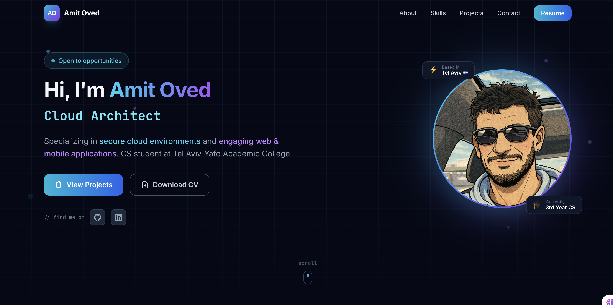
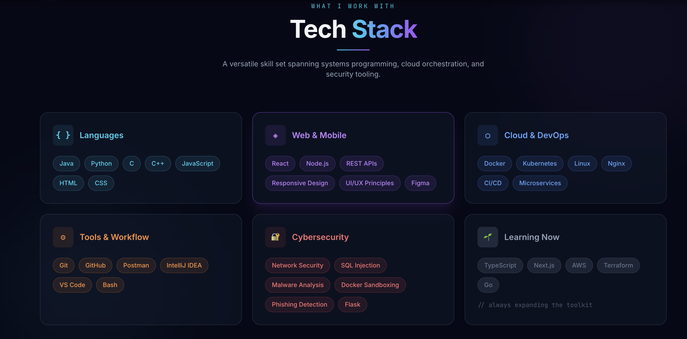
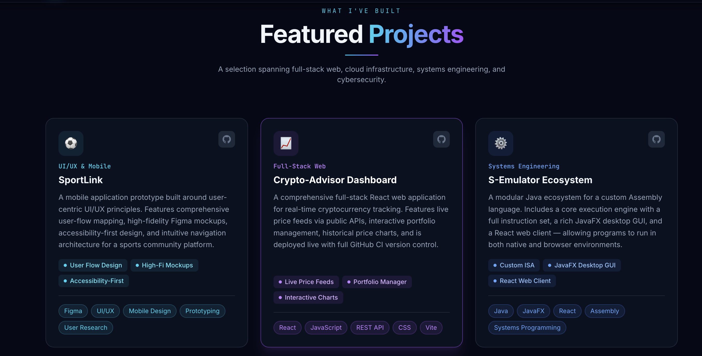
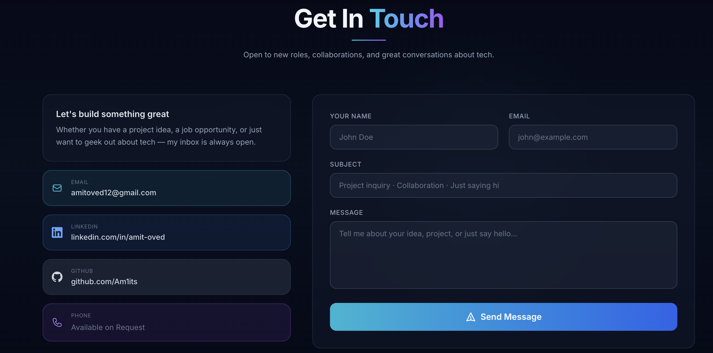
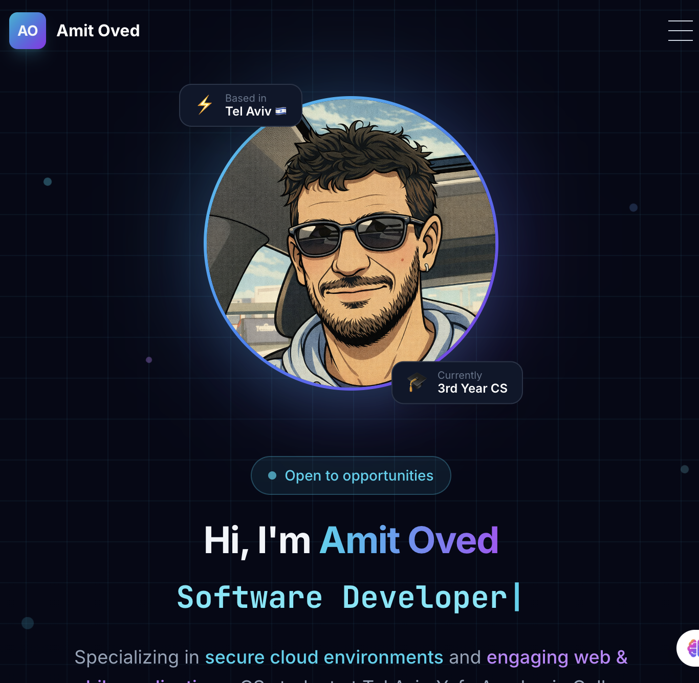

# Amit Oved — Personal Portfolio

A modern, fully responsive personal portfolio website built with **React**, **Vite**, **Tailwind CSS**, and **Framer Motion**.

🌐 **Live:** [amitoved.vercel.app](https://portfolio-eight-rho-89sn7aerco.vercel.app/) 

---

## Screenshots

### Hero


### Tech Stack


### Projects


### Contact


### Mobile


---

## Features

- **Animated hero** — typewriter role cycle, floating profile image with gradient ring, animated CSS grid background
- **Scroll-triggered animations** — every section fades in with Framer Motion as you scroll
- **Tech Stack grid** — colour-coded skill categories with tag badges
- **Project cards** — glassmorphism cards with highlights, tech tags, and GitHub links
- **Contact form** — animated send flow with success state
- **Fully responsive** — mobile-first layout with hamburger nav
- **Downloadable CV** — linked in the navbar and hero CTA

---

## Tech Stack

| Layer | Tech |
|-------|------|
| Framework | React 18 + Vite 5 |
| Styling | Tailwind CSS 3 |
| Animations | Framer Motion 11 |
| Fonts | Inter + JetBrains Mono |
| Deployment | Vercel |

---

## Getting Started

```bash
# Install dependencies
npm install

# Start dev server
npm run dev

# Build for production
npm run build
```

---

## Project Structure

```
src/
├── components/
│   ├── Navbar.jsx
│   ├── Hero.jsx
│   ├── About.jsx
│   ├── Skills.jsx
│   ├── Projects.jsx
│   ├── Contact.jsx
│   └── Footer.jsx
├── data/
│   └── projectsData.js   ← edit project content here
├── App.jsx
└── index.css
```

---

## Contact

- **Email:** amitoved12@gmail.com
- **LinkedIn:** [linkedin.com/in/amit-oved-37365493](https://www.linkedin.com/in/amit-oved-37365493/)
- **GitHub:** [github.com/Am1its](https://github.com/Am1its)
